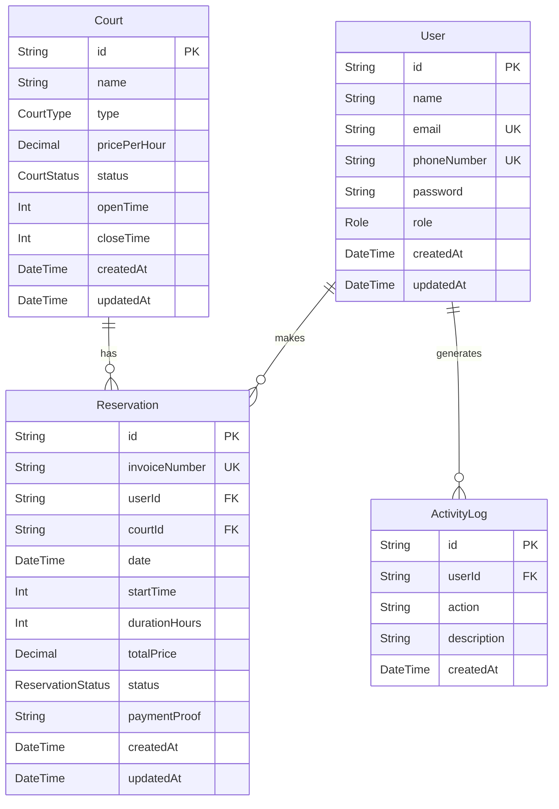

# Entity Relationship Diagram (ERD) & Database Normalization
## SM Sport Center Reservation System

### 1. ERD (Mermaid)

### 2. Database Normalization & Indexing Strategy

*   **1NF (First Normal Form)**: All tables have a primary key (`id` as UUID). All attributes contain atomic values (e.g., `date` and `startTime` are separated for easier querying).
*   **2NF (Second Normal Form)**: No partial dependencies. Everything in `Reservation` depends on the `Reservation`'s primary key.
*   **3NF (Third Normal Form)**: No transitive dependencies. `Court` pricing is stored in `Court`, but the `totalPrice` at the time of booking is stored statically in `Reservation` to prevent historical data corruption if the `Court` price changes in the future.
*   **Indexing Strategy**: 
    *   **Primary Keys**: Indexed automatically (B-Tree).
    *   **Unique Keys**: `email`, `phoneNumber`, `invoiceNumber` have unique constraints (B-Tree index).
    *   **Composite Index**: A unique composite index on `@@unique([courtId, date, startTime])` in the `Reservation` table guarantees at the database level that no two identical slots can be double booked.
    *   **Foreign Keys**: `userId` and `courtId` have relational indexes to speed up joins.
