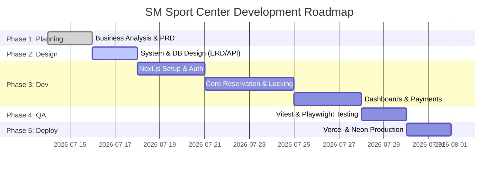

# System Roadmap & Execution Plan
## SM Sport Center Reservation System

This roadmap outlines the systematic, phase-by-phase approach we are taking to design, develop, test, and deploy the SM Sport Center Reservation System.

---

---

## 1. Sprint Planning & Task Breakdown

### Sprint 1: Foundation & Authentication (Days 1-4)
*   **Goal**: Establish system architecture, database schema, and secure access.
*   **Tasks**:
    *   Initialize Next.js 15 App Router project (`sm-sport-center`).
    *   Set up TailwindCSS, Shadcn UI, and Dark Mode.
    *   Configure Neon PostgreSQL and Prisma ORM.
    *   Create ERD and Prisma `schema.prisma`.
    *   Implement Auth.js (NextAuth) for Customer and Admin login.
    *   Setup Middleware for Role-Based Access Control (RBAC).

### Sprint 2: Core Data & Customer Interface (Days 5-8)
*   **Goal**: Enable Admin to manage courts and Customers to view profiles/schedules.
*   **Tasks**:
    *   Admin: CRUD for Courts (Types, Prices, Hours, Status).
    *   Customer: Profile management page.
    *   Customer: Court Availability UI (Date Picker, Slot Grid).
    *   API / Server Actions: Fetching available slots securely.

### Sprint 3: Booking Engine & Payments (Days 9-12)
*   **Goal**: Implement the robust booking system preventing double booking.
*   **Tasks**:
    *   Customer: Submit Reservation with pessimistic locking (`FOR UPDATE`).
    *   System: Generate unique invoice number.
    *   Customer: Upload Payment Proof (Image upload logic).
    *   Admin: Payment Review Interface (Approve/Reject).
    *   System: Update reservation status based on Admin action.

### Sprint 4: Dashboards, Reporting, & QA (Days 13-16)
*   **Goal**: Complete admin reporting tools, optimize performance, and test.
*   **Tasks**:
    *   Admin: Dashboard charts (Bookings, Revenue).
    *   Admin: Export reports (PDF, Excel/CSV).
    *   QA: Write Unit Tests (Vitest) for booking logic.
    *   QA: Write E2E Tests (Playwright) for critical user flows.
    *   Performance: Run profiling on Database Queries and Next.js rendering.

---

## 2. Milestone Definitions

| Milestone | Description | Acceptance Criteria |
|---|---|---|
| **M1: Architecture & DB** | Foundation is ready. | Next.js running, Prisma connected to Neon, Seed data inserted. |
| **M2: Secure Access** | Auth and routing are protected. | Customers and Admins can log in, and middleware blocks unauthorized access. |
| **M3: Core Booking Logic** | Transaction-safe booking. | No double booking allowed; robust database locking confirmed via tests. |
| **M4: E2E Reservation Flow** | Full user journey works. | Customer books -> Uploads proof -> Admin approves -> Booking confirmed. |
| **M5: Analytics & Export** | Reporting is functional. | Admin dashboard shows accurate charts; PDF/Excel exports work. |
| **M6: Production Ready** | Deployed & Tested. | Deployed to Vercel, passing all QA and Security tests (SQL Injection/CSRF checked). |
