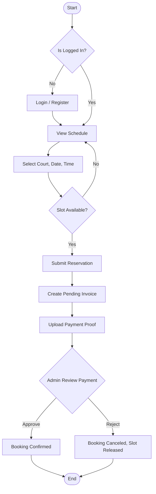
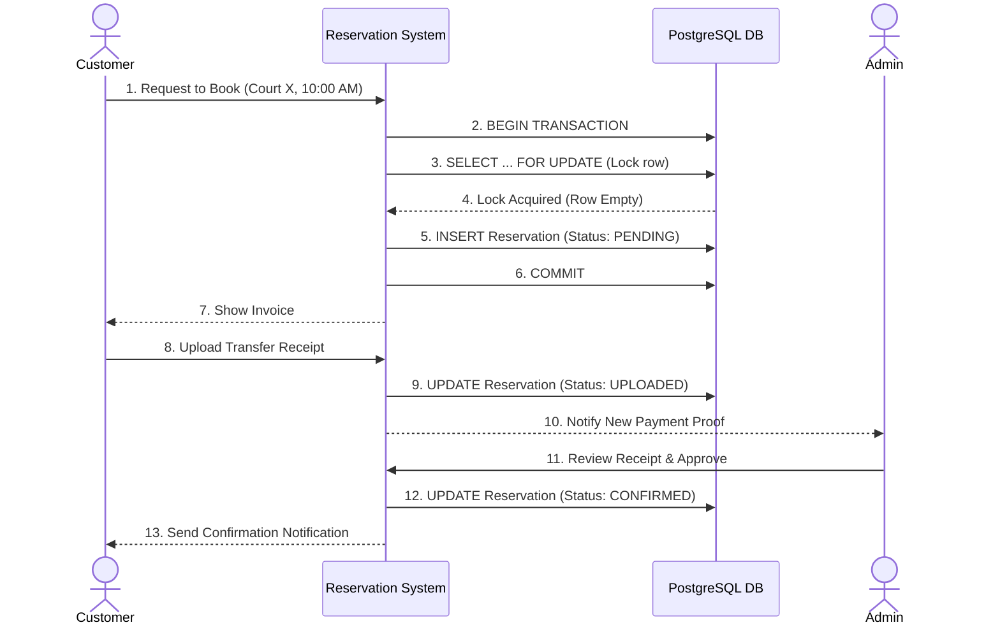
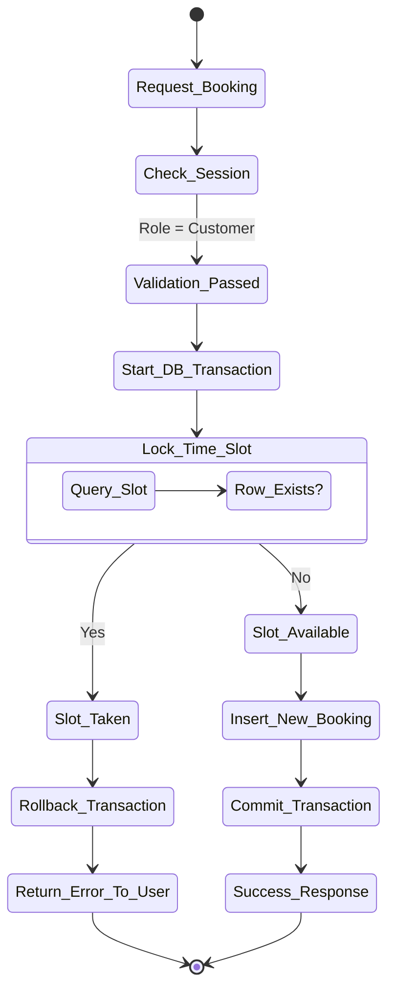

# System Workflows & Business Processes

## 1. Flowchart: General Reservation Process
This flowchart illustrates the high-level steps for making a reservation, from schedule checking to admin approval.

## 2. BPMN (Business Process Model and Notation) - Booking & Payment
Implemented using a Swimlane Diagram to represent the cross-functional processes.

## 3. Activity Diagram: Double Booking Prevention Flow
This details the critical business logic that prevents two customers from booking the exact same court at the exact same time.

